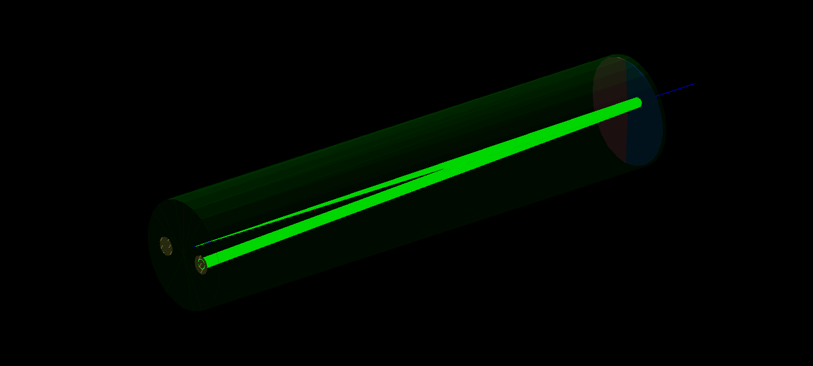

# NA62RICHSim



Monte Carlo simulation of the NA62 RICH detector based on Geant4.

The project aims to reproduce the main components and response of the NA62 Ring Imaging Cherenkov detector and to study its particle identification performance.

In addition, a secondary goal is to allow users to configure and test custom RICH detector setups inspired by the NA62 design.

> [!NOTE]
>
> This project is developed for educational and simulation studies and is not an official NA62 software package.

## Structure

```text
NA62RICHSim/
├── app/               # Application entry points
├── config/            # Detector and simulation configuration files
├── docs/              # Logbook and changelog
├── include/na62rich/  # Public C++ headers
├── macros/            # Geant4 macro files
├── src/               # C++ implementation files
├── tests/             # Unit and integration tests
└── tools/             # Utility programs and scripts
```

## Requirements

* C++17-compatible compiler
* CMake
* Geant4 11.x
* ROOT

> [!WARNING]
>
> The Geant4 installation must include support for optical physics and visualization.

## Compiling

### Clone the repository

Clone the Git repository using the following commands:

```bash
git clone https://github.com/FerrariLuca04/NA62RICHSim
cd NA62RICHSim
```

### Build

From the project root directory (`NA62RICHSim`, if you cloned the GitHub repository), run:

```bash
cmake -S . -B build
cmake --build build -j
```

### Rebuilding the project

After modifying the source code, you usually only need to run:

```bash
cmake --build build -j
```

CMake will automatically recompile only the files affected by the changes.

To perform a clean build, remove the entire `build/` directory, configure the project again, and rebuild it:

```bash
rm -rf build
cmake -S . -B build
cmake --build build -j
```

## Run

The executable will be generated at:

```text
build/bin/na62_rich_sim
```

To start the simulation using the Geant4 interactive UI, run:

```bash
./build/bin/na62_rich_sim
```

Alternatively, the simulation can be executed in batch mode using a Geant4 macro:

```bash
./build/bin/na62_rich_sim macro.mac
```

or:

```bash
./build/bin/na62_rich_sim --macro macro.mac
```

> [!WARNING]
>
> Macro files (`.mac`) must be located in the `macros/` directory.


## Output file

The default output directory is defined as `output/` in `include/na62rich/io/Paths.hh`.

During program execution, the `output/tmp/` directory is created for temporary files and removed when the program terminates.

The default output file is:

```text
output/data_na62rich_sim.root
```

A different output file name can be specified using the `--output` argument:

```bash
./build/bin/na62_rich_sim --output <output_name.root>
```

Alternatively, a `.root` file name can be passed directly as a command-line argument:

```bash
./build/bin/na62_rich_sim <output_name.root>
```

The output file contains a `TTree` named `PhotonHits`, with one entry for each simulated event. Each entry stores the primary-particle properties and the optical-photon hits detected during the event.

The file also contains two additional `TTree`s that store the detector and primary-generator configuration parameters used during the simulation, named `DetectorConfig` and `PrimaryGeneratorConfig`. Each configuration tree contains a single entry, with branches named after the corresponding variables in the configuration files.

For the complete output data structure, see [Output format](docs/output.md).

## Configuration

### Detector

The default detector configuration is stored in:

```text
config/detector_default.conf
```

This file contains the geometrical and material parameters used to construct the detector.

You can modify this file and run the program again without recompiling it. This allows you to change the detector geometry and materials independently of the source code.

To select a custom detector configuration file, use the `--config-detector` argument:

```bash
./build/bin/na62_rich_sim --config-detector <file_name.conf>
```

### Primary generator

The default primary generator configuration is stored in:

```text
config/generator_default.conf
```

This file defines the ranges used to randomly generate the primary-particle properties, including:

* the entrance point;
* the virtual decay vertex, used to determine the particle direction;
* the primary-particle momentum.

As with the detector configuration, you can modify this file and run the program again without recompiling it.

To select a custom generator configuration file, use the `--config-generator` argument:

```bash
./build/bin/na62_rich_sim --config-generator <file_name.conf>
```

For the complete list of available configuration keywords, see [Configuration reference](docs/configuration.md).

> [!WARNING] 
>
> Configuration files (`.conf`) must be located in the `config/detector/` or `config/detector/` directory.

## Tests

Tests are managed with CTest.

After building the project, all tests can be executed with:

```bash
ctest --test-dir build --output-on-failure
```

Tests can also be selected by label:

```bash
ctest --test-dir build -L <label> --output-on-failure
```

The test suite currently includes checks for:

* primary-particle generator (`prymary_generator`);
* Cherenkov photon pruduction (`cherenkov`).

## Python analysis tools

NA62RICHSim includes a small Python package for reading and analyzing the ROOT files produced by the simulation.

The package is located in:

```text
tools/na62rich_analysis/
```

### Installation

The Python tools require Python 3 and the dependencies listed in `tools/setup.py`.

It is recommended to install the package inside a virtual environment:

```bash
python -m venv .venv
source .venv/bin/activate
pip install ./tools
```

On systems where a virtual environment or another isolated Python environment is already available, only the last command is required:

```bash
pip install ./tools
```

For development, the package can be installed in editable mode:

```bash
pip install -e ./tools
```

In this mode, changes made to the source files inside `tools/na62rich_analysis/` are immediately available without reinstalling the package.

### Usage

After installation, the package can be imported as:

```python
import na62rich_analysis as rich
```

For example, a simulation output file can be opened with:

```python
import na62rich_analysis as rich

events = rich.load_events(
    "output/data_na62rich_sim.root"
)

print(events)
```

The available branches can be inspected with:

```python
branches = rich.get_branches(
    "output/data_na62rich_sim.root"
)

print(branches)
```

### Examples

Example scripts using the analysis package are provided in:

```text
tools/examples/
```

For example:

```bash
python tools/examples/read_output.py
```

The examples assume that the `na62rich_analysis` package has already been installed in the active Python environment.

For a complete reference of the available Python functions, including parameters, return values, and possible exceptions, see [Python API refrence](docs/api.md).

The API reference is generated automatically from the function docstrings and can be updated by running python `docs/generate_api.py`.
